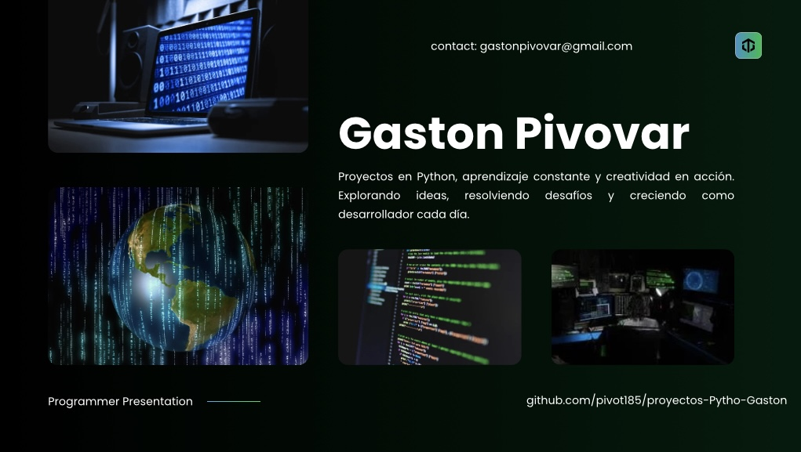

# Proyectos en Python - Gastón

¡Bienvenido a mi colección de mini proyectos en Python!  
Estos ejercicios fueron creados mientras aprendo y practico programación. Algunos con ayuda, otros por mi cuenta.

---

## 1. Lista de Tareas
**Archivo:** `Lista_de_tareas.py`  
**Descripción:**  
Una app de consola para agregar, marcar y eliminar tareas.  
Usa listas de diccionarios y estructuras de control.

**Funciones principales:**
- Agregar nuevas tareas
- Marcar tareas como completadas
- Eliminar tareas completadas

---

## 2. Gestor de Turnos
**Archivo:** `gestor_turnos_menu.py`  
**Descripción:**  
Sistema que permite a los usuarios elegir un horario disponible y guardar la reserva.  
Usa archivo `.json` para persistencia de datos.

---

## 3. Simulador de Compra
**Archivo:** `simulador_compra.py`  
**Descripción:**  
Calcula total de compra en función del producto elegido, cantidad y posibles descuentos.

---

## 4. Calculadora de Precios

**Archivo:** `calculadora_precios.py`
**Descripción:**
Programa que permite ingresar precios de productos, los guarda en una lista, los muestra uno a uno y calcula el total a pagar con redondeo a dos decimales.

Funciones principales:
	•	Ingresar precios
	•	Mostrar lista de precios
	•	Calcular y mostrar el total

---

## 5. Gestor de Notas Escolares

**Archivo:**  `notas_estudiantes.py`
**Descripción:**
Aplicación simple de consola que permite ingresar el nombre y la nota de varios estudiantes.
Muestra al final una lista con cada alumno y su calificación redondeada.
Utiliza listas de diccionarios, for, input() y f-strings.

Funciones principales:
	•	Ingresar nombre y nota de estudiantes
	•	Mostrar listado de notas con formato claro
	•	Redondeo de nota a dos decimales

### Contacto
**Gastón Pivovar**  
Montevideo, Uruguay  
[gastonpivovar@gmail.com](mailto:gastonpivovar@gmail.com)  
